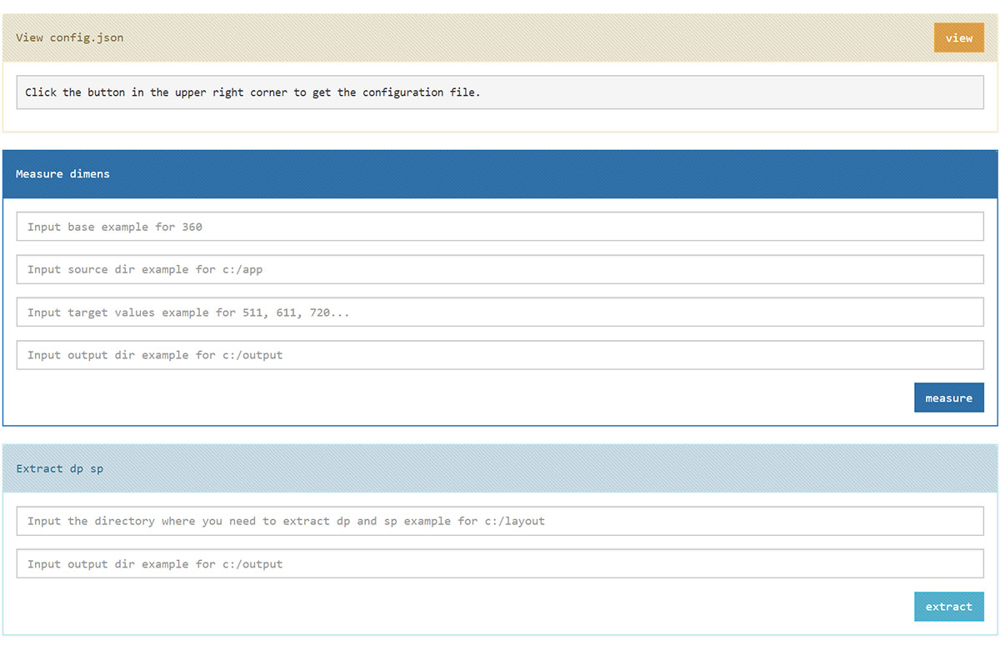

# 

# android-sex-size [](https://travis-ci.org/dtboy1995/android-sex-size)
:tea: a nodejs tools for android screen adaptation

# install

> npm install android-sex-size --global

# usage

### generate config file
- `ruler --config`
- `config.json` is generated in the current directory
```json
{
  "base": 360,
  "source": "replace it with your base dimens.xml path",
  "targets": [ 384,392,400,410,411,480,533,592,600,640,662,720,768,800,811,820 ],
  "output": "replace it with your output path",
  "extract": "replace with the directory where you need to extract dp and sp"
}
```
- there is no width in the target that you want to fit?
  - [download app to get width](apps/infomation.apk)

### measure with config.json
- `ruler --measure config.json`
- generate the directory in the target like `values-sw533dp` `values-sw720dp` ...

### extract with config.json
- `ruler --extract config.json`
- replace the extracted dp and sp files and write the extracted values to dimens.xml in the current directory
- origin
```xml
  <LinearLayout
      xmlns:android="http://schemas.android.com/apk/res/android"
      android:layout_width="200dp"
      android:layout_height="100dp"
      android:orientation="vertical">
  </LinearLayout>
```
- current
```xml
  <LinearLayout
      xmlns:android="http://schemas.android.com/apk/res/android"
      android:layout_width="@dimens/ithot03f7970aad3e"
      android:layout_height="@dimens/ithote77e3bde81fa"
      android:orientation="vertical">
  </LinearLayout>
```
- dimens.xml
```xml
  <?xml version="1.0" encoding="utf-8"?>
  <resources>
    <dimen name="ithot03f7970aad3e">200dp</dimen>
    <dimen name="ithote77e3bde81fa">100dp</dimen>
  </resources>
```

### dragon *not published*
- `ruler --dragon config.json`

### start gui
- `ruler --gui`
- browse **localhost:8888** snapshot

# 

# others
- :page_facing_up: [some screen snippets](screens/snippets.md)
