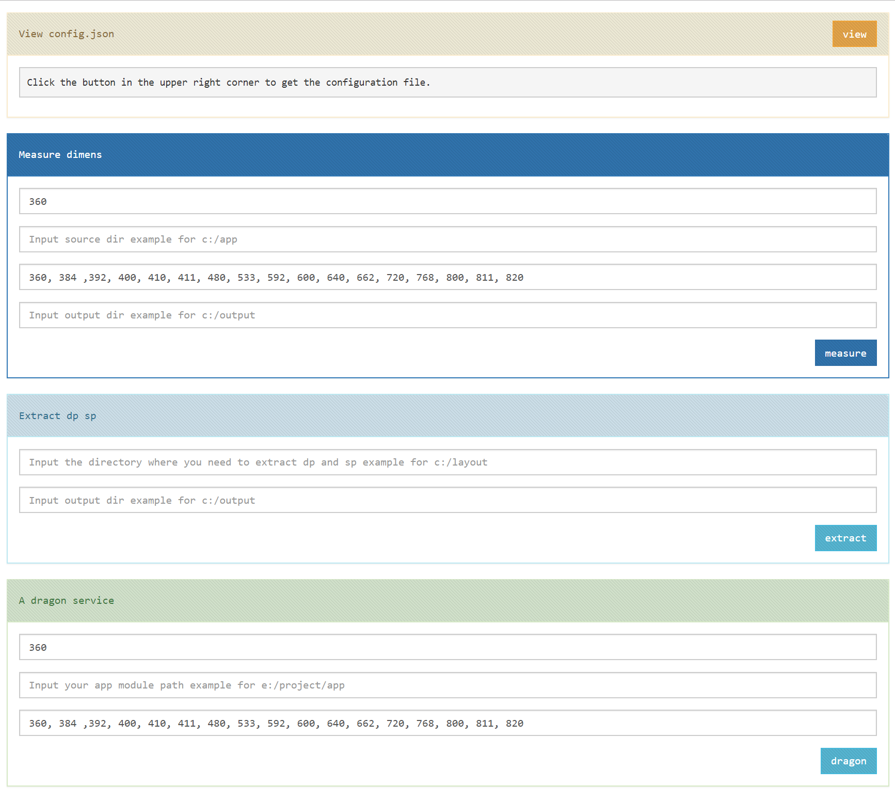

# 

# android-sex-size [](https://travis-ci.org/dtboy1995/android-sex-size)
:boom: 一个nodejs小工具去搞Android屏幕适配

# 安装
```
npm install android-sex-size --global
```

# 用法

### 生成配置文件
- `ruler --config`
- `config.json` 会在当前目录下生成
```json
{
  "base": 360,
  "source": "基准dimens.xml的路径，上面的base配置的时360dp基准的，您就找下这个xml的路径写在这儿就行",
  "targets": [ 384,392,400,410,411,480,533,592,600,640,662,720,768,800,811,820 ],
  "output": "自定义生成完毕的输出路径",
  "extract": "这好像是个鸡肋功能，就是把一个目录下所有的xml文件中的dp sp都抽离出来换成变量。"
}
```
- 这里有个apk可以查看你测试机的屏幕宽度dp
  - [可以点这儿下载](apps/infomation.apk)

### 配合config.json去搞
- `ruler --measure config.json`
- 他会生成这样的目录，感觉还是很鸡肋 `values-sw533dp` `values-sw720dp` ...

### 配合config.json去搞
- `ruler --extract config.json`
- 替换配置目录下所有xml中的dp和sp将定值抽成一个变量到当前目录下的dimens.xml
- 原来是这样的
```xml
  <LinearLayout
      xmlns:android="http://schemas.android.com/apk/res/android"
      android:layout_width="200dp"
      android:layout_height="100dp"
      android:orientation="vertical">
  </LinearLayout>
```
- 搞完之后
```xml
  <LinearLayout
      xmlns:android="http://schemas.android.com/apk/res/android"
      android:layout_width="@dimens/ithot03f7970aad3e"
      android:layout_height="@dimens/ithote77e3bde81fa"
      android:orientation="vertical">
  </LinearLayout>
```
- 当前目录下的dimens.xml
```xml
  <?xml version="1.0" encoding="utf-8"?>
  <resources>
    <dimen name="ithot03f7970aad3e">200dp</dimen>
    <dimen name="ithote77e3bde81fa">100dp</dimen>
  </resources>
```

### 一条龙 (抽离变量顺便生成屏幕宽度的目录)
- `ruler --dragon config.json`

### 启动GUI，不喜欢命令行的可以使这个，其实也挺鸡肋的
- `ruler --gui`
- 下面是浏览器 **localhost:8888** 的截图

# 

# 其他的
- :page_facing_up: [一些屏幕设备的屏幕参数](screens/snippets.md)
